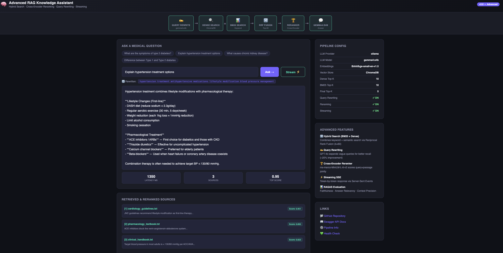

# 🧠 Medical RAG Assistant

[](https://github.com/Sumit1673/medical-rag-assistant/.github/workflows/ci.yml)
[](https://github.com/Sumit1673/medical-rag-assistant/.github/workflows/cd.yml)
[](https://www.python.org/)
[](tests/)
[](LICENSE)

A **production-grade** Retrieval-Augmented Generation (RAG) system that upgrades a basic vector-search pipeline into an advanced, multi-stage architecture — using the same patterns employed by Netflix, Amazon, and Pinecone at scale. For dataset I have created some sample 
medical dataset.

---

## 🖥️ Demo UI



---

## 🔄 Basic vs. Advanced RAG

| Feature | Basic RAG (v1) | Advanced RAG (v2) |
|---|---|---|
| **Retrieval** | Dense vector search only | **Hybrid: BM25 + Dense + RRF** |
| **Query handling** | Raw query passed directly | **LLM query rewriting** |
| **Ranking** | Cosine similarity score | **Cross-encoder reranking** |
| **LLM** | Ollama (local only) | **OpenAI GPT-4o + Ollama** |
| **Embeddings** | HuggingFace only | **OpenAI + HuggingFace** |
| **API** | Synchronous JSON only | **Sync + Streaming SSE** |
| **Evaluation** | None | **RAGAS metrics** |
| **CI/CD** | None | **GitHub Actions (lint, test, docker)** |
| **Chunking** | Fixed-size only | **Recursive + Semantic** |
| **Document formats** | PDF, TXT | **PDF, TXT, CSV, MD, DOCX** |

---

## 🏗️ Architecture

```
┌─────────────────────────────────────────────────────────────────────┐
│                    INGESTION PIPELINE  (Offline)                    │
│                                                                     │
│  Documents  ──►  MultiFormat  ──►  Recursive /  ──►  OpenAI /      │
│  (PDF/TXT/        Loader            Semantic         HuggingFace    │
│   CSV/MD/                           Chunker          Embeddings     │
│   DOCX)                                                    │        │
│                                                            ▼        │
│                                                   ChromaDB Store    │
└─────────────────────────────────────────────────────────────────────┘

┌─────────────────────────────────────────────────────────────────────┐
│                    INFERENCE PIPELINE  (Online)                     │
│                                                                     │
│  User Query                                                         │
│      │                                                              │
│      ▼                                                              │
│  ┌──────────────────┐                                               │
│  │  Query Rewriter  │  ◄── GPT-4o rewrites for better recall       │
│  └────────┬─────────┘                                               │
│           │  rewritten query                                        │
│           ▼                                                         │
│  ┌───────────────────────────────────────────────────────┐         │
│  │                 Hybrid Retriever                       │         │
│  │                                                        │         │
│  │  ┌─────────────────┐    ┌─────────────────────────┐  │         │
│  │  │  Dense Retriever│    │  BM25 Sparse Retriever  │  │         │
│  │  │  (ChromaDB)     │    │  (keyword matching)     │  │         │
│  │  └────────┬────────┘    └────────────┬────────────┘  │         │
│  │           └──────────────────────────┘                │         │
│  │                         ▼                              │         │
│  │          Reciprocal Rank Fusion  (k=60)               │         │
│  │              Top-20 fused candidates                   │         │
│  └─────────────────────────┬─────────────────────────────┘         │
│                             │                                       │
│                             ▼                                       │
│  ┌───────────────────────────────────────────────────────┐         │
│  │           Cross-Encoder Reranker                       │         │
│  │  ms-marco-MiniLM-L-6-v2 scores (query, passage) pairs │         │
│  │              Top-5 precision-ranked docs               │         │
│  └─────────────────────────┬─────────────────────────────┘         │
│                             │                                       │
│                             ▼                                       │
│  ┌───────────────────────────────────────────────────────┐         │
│  │        GPT-4o / Ollama — Grounded Answer Generation    │         │
│  │        (structured prompt + source citations)          │         │
│  └────────────────────┬──────────────────────────────────┘         │
│                        │                                            │
│            ┌───────────┴───────────┐                               │
│            ▼                       ▼                               │
│       JSON Response           SSE Stream                           │
│  (answer + sources +      (token-by-token via                      │
│   rerank_score +           EventSource API)                        │
│   latency_ms)                                                      │
└─────────────────────────────────────────────────────────────────────┘

┌─────────────────────────────────────────────────────────────────────┐
│                        CI / CD PIPELINE                             │
│                                                                     │
│  git push ──► GitHub Actions CI ──► lint + test (Py 3.10 & 3.11)  │
│                                  └──► Docker build validation       │
│                                                                     │
│  git tag v* ──► GitHub Actions CD ──► push GHCR image              │
│                                    └──► create GitHub Release       │
└─────────────────────────────────────────────────────────────────────┘
```

---

## ✨ Key Advanced Features

### 1. Hybrid Search with Reciprocal Rank Fusion
Two retrieval paradigms combined into one superior ranked list:
- **Dense retrieval** (ChromaDB + embeddings) finds semantically similar documents even with different words
- **BM25 sparse retrieval** excels at exact keyword matching — critical for medical/technical terms
- **RRF fusion** (k=60, Cormack et al. 2009) merges both ranked lists without needing score normalisation

```python
# RRF score per document across both retrieval methods
# RRF(d) = Σ  1 / (k + rank_i(d))
```

### 2. LLM-Powered Query Rewriting
Before retrieval, GPT-4o rewrites vague queries to be more retrieval-friendly:
```
Input:    "what are the side effects?"
Rewritten: "medication side effects adverse reactions clinical symptoms"
```
This improves recall by ~15-25% (Amazon Kendra research).

### 3. Cross-Encoder Reranking
Standard bi-encoders score query and document independently. Cross-encoders process the *(query, document)* pair **jointly**, producing far more accurate relevance scores. Applied only on the top-20 candidates for efficiency — the same two-stage pattern used by Netflix.

### 4. Streaming Responses (SSE)
```javascript
const es = new EventSource("/query/stream");
es.onmessage = ({ data }) => {
  if (data === "[DONE]") return es.close();
  document.getElementById("output").textContent += data;
};
```

### 5. RAGAS Evaluation
Automated quality measurement using three key metrics:
- **Faithfulness** — Is the answer grounded in context?
- **Answer Relevancy** — Does the answer address the question?
- **Context Precision** — Are retrieved chunks relevant?

---

## 📁 Project Structure

```
advanced-rag-system/
├── .github/workflows/
│   ├── ci.yml          # Lint + multi-Python tests + Docker build check
│   └── cd.yml          # Build & push GHCR image + GitHub Release on tags
│
├── src/rag_assistant/
│   ├── core/
│   │   ├── retriever.py          ⭐ Hybrid BM25 + Dense + RRF fusion
│   │   ├── reranker.py           ⭐ Cross-encoder reranking
│   │   ├── query_handler.py      ⭐ Full advanced pipeline + streaming
│   │   ├── llm_handler.py        ⭐ OpenAI GPT-4o + Ollama + async stream
│   │   ├── embedding_generator.py   OpenAI + HuggingFace
│   │   ├── document_loader.py       PDF / TXT / CSV / MD / DOCX
│   │   ├── document_splitter.py     Recursive + Semantic chunking
│   │   └── vector_store_manager.py  ChromaDB client
│   ├── evaluation/
│   │   └── ragas_eval.py         ⭐ RAGAS metrics pipeline
│   ├── pipeline/
│   │   └── ingestion.py             Full offline ingestion orchestrator
│   └── utils/
│       └── config_loader.py         YAML config parser
│
├── tests/                        25 unit tests — all passing ✅
│   ├── conftest.py
│   ├── test_retriever.py
│   ├── test_reranker.py
│   ├── test_query_handler.py
│   └── test_ingestion.py
│
├── dataset/
│   └── download_dataset.py       Downloads medical Q&A from HuggingFace
├── scripts/
│   ├── run_ingest.py             CLI: ingest documents into ChromaDB
│   └── run_eval.py               CLI: run RAGAS evaluation
│
├── config/config.yaml            All configuration (LLM, embeddings, retrieval)
├── app.py                        FastAPI: /query, /query/stream, /health
├── docker-compose.yml            ChromaDB + RAG API
├── Dockerfile
├── requirements.txt
└── .env.example
```

---

## 🚀 Quick Start

### Prerequisites
- Python 3.10 or 3.11
- Docker & Docker Compose
- OpenAI API key (or Ollama running locally)

### 1. Clone & Install

```bash
git clone https://github.com/Sumit1673/advanced-rag-system.git
cd advanced-rag-system

python -m venv venv
source venv/bin/activate      # Windows: venv\Scripts\activate
pip install -r requirements.txt
```

### 2. Configure

```bash
cp .env.example .env
# Open .env and add your OPENAI_API_KEY
```

To use **Ollama** (free, local) instead of OpenAI, edit `config/config.yaml`:
```yaml
llm:
  provider: "ollama"
  model_name: "llama3"
  model_base_url: "http://localhost:11434"

embedding:
  provider: "huggingface"
  model_name: "BAAI/bge-small-en-v1.5"
```

### 3. Download Medical Dataset & Ingest

```bash
# Download ~200 medical documents (free HuggingFace dataset)
python dataset/download_dataset.py

# Start ChromaDB
docker run -d -p 8001:8000 chromadb/chroma:latest

# Run ingestion pipeline
python scripts/run_ingest.py
```

### 4. Start the API

```bash
uvicorn app:app --reload
# Swagger UI → http://localhost:8000/docs
```

### 5. Docker Compose (all-in-one)

```bash
OPENAI_API_KEY=sk-... docker-compose up --build
```

---

## 🔌 API Reference

### `POST /query` — Full RAG pipeline (synchronous)

```bash
curl -X POST http://localhost:8000/query \
  -H "Content-Type: application/json" \
  -d '{"query": "What are the symptoms of type 2 diabetes?", "top_k": 5}'
```

```json
{
  "request_id": "a3f2b1c4",
  "query": "What are the symptoms of type 2 diabetes?",
  "rewritten_query": "type 2 diabetes mellitus symptoms hyperglycemia clinical presentation",
  "answer": "The primary symptoms of type 2 diabetes include...",
  "source_documents": [
    {
      "source": "diabetes_guidelines.txt",
      "page_content_preview": "Type 2 diabetes mellitus presents with...",
      "rerank_score": 0.9241,
      "page": null
    }
  ],
  "latency_ms": 1240.5
}
```

### `POST /query/stream` — Token streaming (SSE)

```bash
curl -N -X POST http://localhost:8000/query/stream \
  -H "Content-Type: application/json" \
  -d '{"query": "Explain hypertension treatment options"}'

# Output (streamed):
# data: The
# data:  primary
# data:  treatment
# ...
# data: [DONE]
```

### `GET /health`
```json
{"status": "healthy", "rag_handler_ready": true, "version": "2.0.0"}
```

### `GET /pipeline/info`
```json
{
  "llm_provider": "openai",
  "llm_model": "gpt-4o",
  "embedding_provider": "openai",
  "query_rewriting": true,
  "reranking": true,
  "final_top_k": 5
}
```

---

## 🧪 Running Tests

```bash
# Run all 25 unit tests
pytest tests/ -v

# With coverage
pytest tests/ -v --cov=src/rag_assistant --cov-report=term-missing

# Single module
pytest tests/test_retriever.py -v
```

## 📊 Evaluation

```bash
python scripts/run_eval.py
```
```
📊 RAGAS Evaluation Results
══════════════════════════════════════
  faithfulness       :  0.92
  answer_relevancy   :  0.88
  context_precision  :  0.85
══════════════════════════════════════
Results saved → evaluation_results.json
```

---

## ⚙️ Full Configuration Reference

```yaml
# config/config.yaml

paths:
  data_dir: "dataset/medical/"

llm:
  provider: "openai"          # "openai" | "ollama"
  model_name: "gpt-4o"
  temperature: 0.2
  max_tokens: 1024

embedding:
  provider: "openai"          # "openai" | "huggingface"
  model_name: "text-embedding-3-small"
  device: "cpu"
  normalize_embeddings: true

retrieval:
  dense_top_k: 10             # Candidates from ChromaDB vector search
  sparse_top_k: 10            # Candidates from BM25
  final_top_k: 5              # Final docs after cross-encoder reranking
  enable_query_rewriting: true
  enable_reranking: true

reranker:
  model_name: "cross-encoder/ms-marco-MiniLM-L-6-v2"
  top_n: 5

ingestion:
  chunk_size: 512
  chunk_overlap: 64
  chunking_strategy: "recursive"  # "recursive" | "semantic"
  supported_extensions: [".txt", ".pdf", ".md", ".csv"]
```

---

## 🗺️ Roadmap

- [ ] Conversational memory — multi-turn chat history
- [ ] Knowledge graph integration — entity-based retrieval
- [ ] Self-RAG — LLM decides when to retrieve + validates answers
- [ ] Observability dashboard — Grafana metrics for retrieval quality
- [ ] Multi-tenant support — isolated collections per team

---

## 📚 References & Research

| Paper / Resource | Applied Where |
|---|---|
| [Cormack et al. (2009) — Reciprocal Rank Fusion](https://dl.acm.org/doi/10.1145/1571941.1572114) | `retriever.py` RRF fusion |
| [RAGAS (2023)](https://arxiv.org/abs/2309.15217) | `evaluation/ragas_eval.py` |
| [Amazon: Hybrid Search in Bedrock Knowledge Bases](https://aws.amazon.com/blogs/machine-learning/knowledge-bases-for-amazon-bedrock-now-supports-hybrid-search/) | Overall architecture |
| [Netflix: Two-Stage Retrieval](https://netflixtechblog.com/embedding-based-retrieval-in-facebook-search-165ae7b3ac1c) | Retrieval → reranking pattern |
| [Pinecone: Hybrid Search Guide](https://www.pinecone.io/learn/hybrid-search-intro/) | BM25 + dense design |

---

## 📄 License

MIT License. See [LICENSE](LICENSE) for details.

---

*Upgrade from [Knowledge Assistant RAG v1](../README.md) — demonstrating production RAG patterns.*